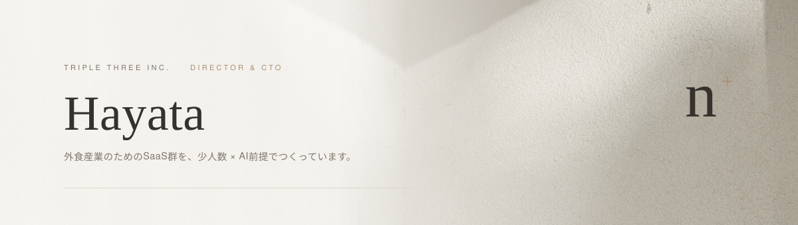
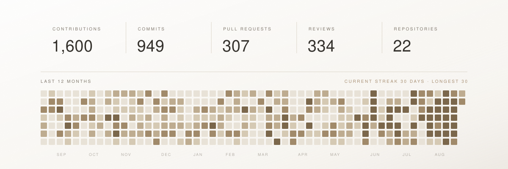

<picture>
  <source media="(prefers-color-scheme: dark)" srcset="assets/hero-dark.svg" />
  
</picture>

  <a href="https://www.linkedin.com/in/hayata-nakagawa/"><picture><source media="(prefers-color-scheme: dark)" srcset="assets/nav-linkedin-dark.svg" /></picture></a>
  &nbsp;&nbsp;&nbsp;
  <a href="https://zenn.dev/p/triplethree"><picture><source media="(prefers-color-scheme: dark)" srcset="assets/nav-blog-dark.svg" /></picture></a>
  &nbsp;&nbsp;&nbsp;
  <a href="https://333-inc.com/"><picture><source media="(prefers-color-scheme: dark)" srcset="assets/nav-site-dark.svg" /></picture></a>
  &nbsp;&nbsp;&nbsp;
  <a href="https://333-inc.tt-recruit.com/"><picture><source media="(prefers-color-scheme: dark)" srcset="assets/nav-recruit-dark.svg" /></picture></a>

> 株式会社トリプルスリー — 外食産業向けのHR-tech企業（2018年創業・導入100社超）
>
> プロダクト開発／技術戦略／技術組織の設計／コーポレートIT
>
> 職種を問わず全員がAIを使い倒す「少人数 × AI前提」の組織づくりを実践中。毎日の相棒は Claude Code

<picture>
  <source media="(prefers-color-scheme: dark)" srcset="assets/stats-dark.svg" />
  
</picture>
